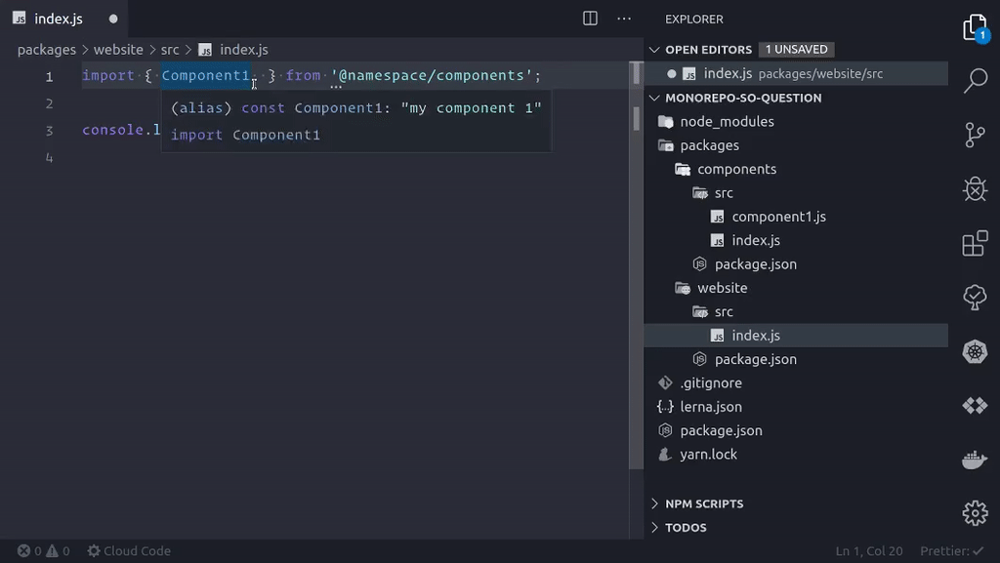

# Javascript Monorepo with Lerna on VSCode

This repository is an example for [this](https://stackoverflow.com/questions/57870542/how-should-vscode-be-configured-to-support-a-lerna-monorepo) StackOverflow question

The monorepo makes use of a combination of `lerna` and `yarn workspaces`. You can find more information on this topic here: https://youtu.be/EoqzOEZIzhg.

## Requirements

- yarn

## Setup

```
yarn boostrap
```

## Intellisense Preview



## File tree

```
├── lerna.json
├── package.json
├── packages
│   ├── components
│   │   ├── package.json
│   │   └── src
│   │       ├── component1.js
│   │       └── index.js
│   └── website
│       ├── package.json
│       └── src
│           └── index.js
├── README.md
└── yarn.lock
```
